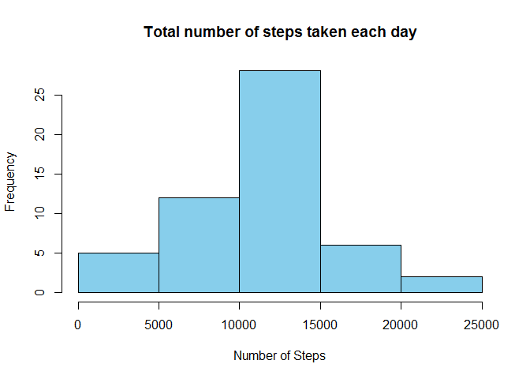
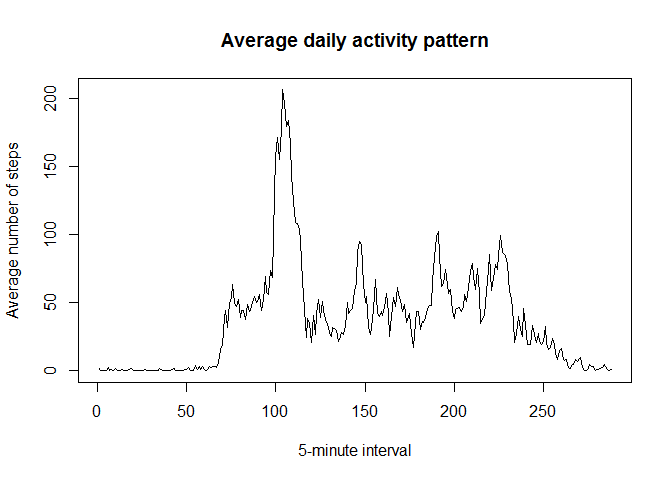
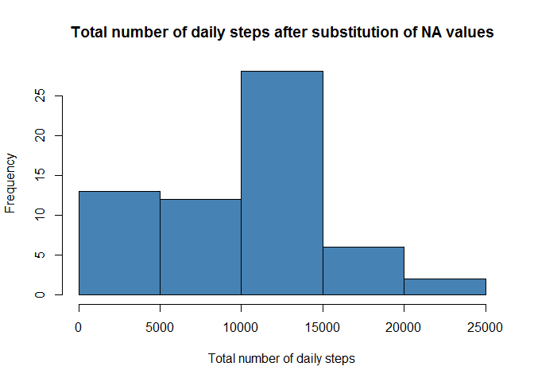
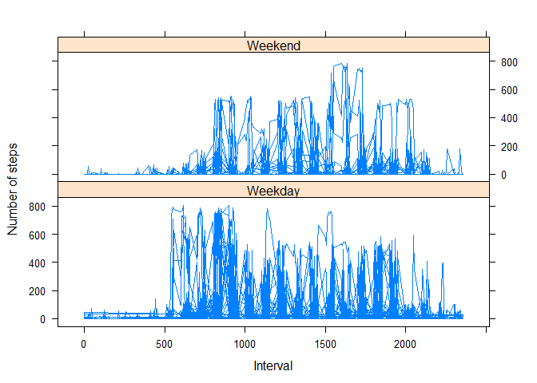

# Reproducible Research: Peer Assessment 1


## Loading and preprocessing the data
At the beginning we need to unzip and read the data provided for analysis and transform them into appropriate formats

```r
filename <- "activity.zip"
data <- read.csv (unzip (filename), na.strings="NA")
data$date <- as.Date(data$date)
```

## What is mean total number of steps taken per day?

To calculate the total number of steps per day I am using a dplyr package

```r
library("dplyr")
```

```
## 
## Attaching package: 'dplyr'
## 
## The following object is masked from 'package:stats':
## 
##     filter
## 
## The following objects are masked from 'package:base':
## 
##     intersect, setdiff, setequal, union
```

```r
steps_per_day <- summarize (group_by (data, date), n_steps = sum (steps))
```

The following histogram describes the number of steps taken per day:

```r
hist (steps_per_day$n_steps,
      xlab = "Number of Steps", 
      main = "Total number of steps taken each day",
      col="skyblue")
```

 

The following code calculates the mean and the median of total steps taken per day:

```r
steps_per_day_mean <- mean (steps_per_day$n_steps, na.rm="true")
steps_per_day_median <- median (steps_per_day$n_steps, na.rm="true")
```

Finally, the mean of total daily steps is 1.0766189\times 10^{4} and the median is 10765.

## What is the average daily activity pattern?

To calculate average daily activity pattern, first we average number of steps taken in particulat interval for each day. 

```r
steps_by_interval<-tapply(data$steps,data$interval,mean,na.rm=TRUE)
```

The following plot illustrates distribution of dayly activity across five-minute intervals:

```r
plot (steps_by_interval, 
     type="l",
     xlab = "5-minute interval",
     ylab = "Average number of steps",
     main = "Average daily activity pattern")
```

 

Interval with the maximum number of steps taken on average is calculated using the following code:

```r
steps_by_interval[max(steps_by_interval)]
```

```
##     1705 
## 56.30189
```

## Imputing missing values

At first we found the number of missing values in the dataset with the following code:

```r
tNA <- sum(is.na(data$steps))
```
The total number of missing values in the dataset is 2304.

Now we replace all NA with interval average number of steps and create a new dataset for further analisys: 

```r
d <- data

for (i in which (sapply (d, is.numeric))) {
    d [is.na(d[, i]), i] <- (mean(d[, i],  na.rm = TRUE)/288)
}
d <- aggregate(steps ~ date, d, sum)
```

Then we construct the new histogram with the total number of steps taken per day:

```r
hist(d$steps, 
     xlab="Total number of daily steps", 
     main="Total number of daily steps after substitution of NA values",
     col="steelblue")
```

 

```r
new_mean <- mean (d$steps)
new_median <- median (d$steps)

mean_dif <- new_mean - steps_per_day_mean
median_dif <- new_median - steps_per_day_median
```

The new mean is 9359.1321442 and median is 1.0395\times 10^{4}. As a result of substitution of NA values, the new mean is -1407.056535 and the new median is -370 adjusted that the original data.

## Are there differences in activity patterns between weekdays and weekends?

In order to look at the differences between weekdays and weekends, we first need to set the system language settings to English and add a new coloumn that identifies whether a given date falls on a weekend or a weekend.

```r
Sys.setlocale ("LC_ALL", "C")
```

```
## [1] "C"
```

```r
data$day <- as.factor (ifelse (weekdays (data$date) %in% c ("Saturday","Sunday"), "Weekend", "Weekday"))
```

Then we can plot these on a system of two plots, one for the weekdays and the other for the weekends.


```r
weekday <- c ("Monday","Tuesday","Wednesday","Thursday","Friday")
weekend <- c ("Saturday","Sunday")
wday <- as.factor(data$day)
library (lattice)
xyplot (data$steps ~ data$interval | as.factor(data$day), data=data, pch=1, xlab="Interval",  ylab="Number of steps",layout = c (1,2), type = "l")
```

 
It is evident that there is considerably more movement in earlier interval on weekdays, while in the weekend, later intervals show more steps taken.
